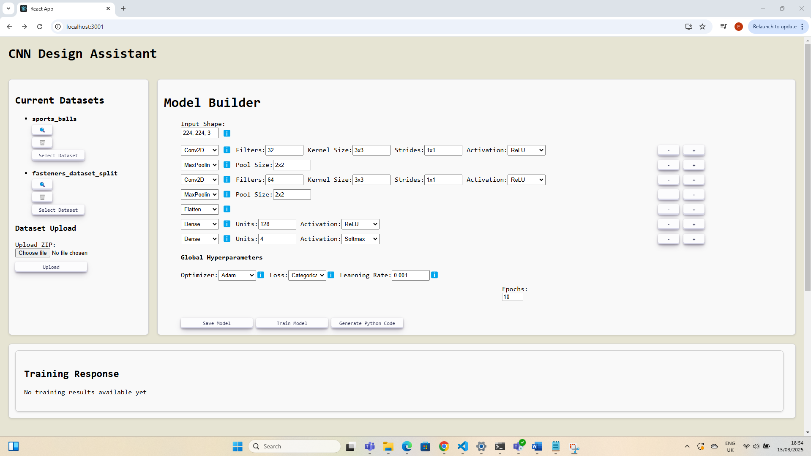
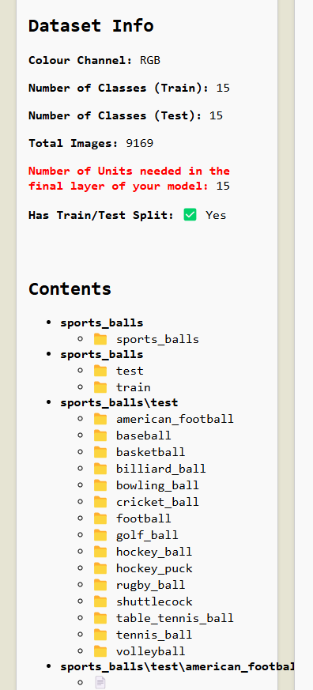
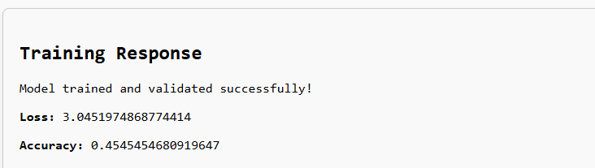
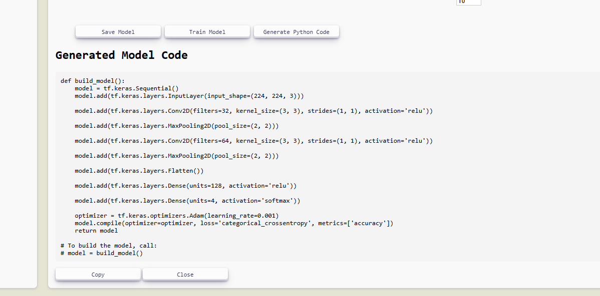

# Web-Based CNN Design Assistant

## About

An application that simplifies the design, training, and visualization of Convolutional Neural Networks (CNNs) for image recognition tasks.

- **Beginner-friendly Interface:** Abstracted the complex coding workflow required for training CNNs into an intuitive UI, allowing users with little to no experience in deep learning to easily train models without writing code.
- **Key Features:**
  - Dataset upload functionality
  - Intuitive, layer-by-layer model creation
  - Training progress visualization
  - Ability to export Python code for advanced workflows

## Features

### Layer-by-Layer CNN Model Creation with Validation on Save

Users can interactively build CNN architectures one layer at a time. Each model configuration is validated upon saving to ensure correctness and catch potential design errors early.

### Dataset Content Inspection and Metadata Retrieval

The platform allows users to inspect uploaded datasets, viewing both content and associated metadata (such as image size, class distribution, and file counts).

### Example: Training Response for User-Defined Model

Once a dataset is uploaded and a CNN model is created, users can trigger local training. The interface provides feedback on the training process, including loss values, accuracy scores, and training time.

### TensorFlow CNN Code Generation Based on User-Defined Models

After designing a model through the interface, users can automatically generate the equivalent TensorFlow (Keras) Python code, making it easy to export, refine, and deploy models in external development environments.

## View the report
[Click here for the full report](./report.pdf)

